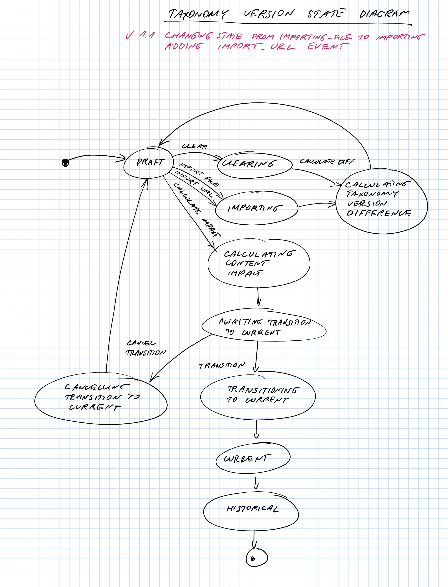

# Taxonomies for Confluence

Use Confluence for enterprise architecture, data governance, compliance and more with taxonomies and save on specialized tools.

## Caution

Azure subscription used to host the add-on is no longer available. None of the queue, key, blob and other identifiers are valid, so anyone attempting to self-host the add-on will need to take care of the infrastructure set up.

## Building

Build sequence to automate:

```
mvn clean install validate
npm install
npm run release
mvn package -DskipTests
```

## Running locally

Install the ngrok tunnel:

```
sudo alternatives --install /usr/bin/ngrok ngrok <path to ngrok> <priority>
```

Run the tunnel on specific port:

```
ngrok http -subdomain=dalstonsemantics -region=au 8110
```

Running the actual application with Maven (default URL of https://dalstonsemantics.au.ngrok.io is baked into default config):

```
mvn spring-boot:run
```

Running the actual application with Java using fat jar (default URL of https://dalstonsemantics.au.ngrok.io is baked into default config):

```
java -jar target/taxonomies-for-confluence-MAJOR.MINOR.POINT.jar
```

## Confluence Search

Text must be included in quotes, othwewise `taxonomiesForConfluenceSubjectNotation`, `taxonomiesForConfluenceSubjectUri` and `taxonomiesForConfluenceSubjectPreferredLabel` can be used with CQL. AltLabel is not included in the index because (a) Atlassian doesnt support it and (b) Use case for alt labels is human readability and search, not integration.

https://dalstonsemantics.atlassian.net/wiki/rest/api/search?cql=taxonomiesForConfluenceSubjectNotation=7291&limit=25
https://dalstonsemantics.atlassian.net/wiki/rest/api/search?cql=taxonomiesForConfluenceSubjectUri=%22https://dalstonsemantics.com/ns/au/gov/abs/anzsic/7291%22&limit=25
https://dalstonsemantics.atlassian.net/wiki/rest/api/search?cql=taxonomiesForConfluenceSubjectPreferredLabel="Office Administrative Services"&limit=25

https://dalstonsemantics.atlassian.net/wiki/rest/api/search?cql=taxonomiesForConfluenceTypeUri=%22https://dalstonsemantics.com/taxonomy/sdlc/readme%22&limit=25
https://dalstonsemantics.atlassian.net/wiki/rest/api/search?cql=taxonomiesForConfluenceTypePreferredLabel="Readme"&limit=25

## Design

## Renaming properties and separating subject and type

Atlassian recommendation is to prefix the property key with the name of your add-on to ensure they are globally unique. There are several alternatives:

 1. Use `taxonomiesForConfluence` as prefix (so resulting names are `taxonomiesForConfluenceSubject`, `taxonomiesForConfluenceSubjectNotation`, etc.). It follows the recommendation, but name of our plugin may change going forward
 2. Use `dalstonSemantics` as prefix (so resulting names are `dalstonSemanticsSubject`, `dalstonSemanticsSubjectNotation`, etc.). It lets us vary the plugin name, but does not follow the guide to the letter.
 3. Use `dcterms` as prefix (so resulting names are `dctermsSubject`, `dctermsSubjectNotation`, etc.). It lets us vary the plugin name, explicitly matches the property used in the knowledge graph, but does not follow the guidelines at all and vast majority of people will not know what `dcterms` stand for.

Decision - use option #1 (`taxonomiesForConfluence` prefix).

Given that we now have two bylines that may actually be swapped on load, we need to decide what to do with the icons.

Decision - Keep concept scheme and concept icons for the tables. In pages use "S tab" for Subject icon, "T tab" for Type icon and "R tab" for Relation macro.

### Identifiers

1. Adopt `https` as a scheme for namespaces created or used in connection with this application.
1. `Host` repository has single context.
1. `Taxonomies` repository has 3 contexts per client: `https://tfc.dalstonsemantics.com/taxonomy/${iss}-${version}`, `https://tfc.dalstonsemantics.com/content/${iss}` and `https://tfc.dalstonsemantics.com/taxonomy-version/${iss}` where `iss` is the client identifier supplied by confluence, `${version}` is generated by the add-on.
    1. Taxonomy stores all imported taxonomies and their provenance.
    1. Content stores all content and subject data and their provenance.
    1. Taxonomy version stores the versions as a linked list
1. Content is `https://tfc.dalstonsemantics.com/content/{iss}-${content}` where `iss` is the client identifier supplied by Confluence and `content` is unique identifier of content within the client instance supplied by Confluence, supplied by Confluence. This includes pages, blog posts (with `team:page` or `team:blogpost` types) and properties (recorded as `rdf:Statement` with `rdf:predicate` set to `dc:subject`). Macros are created with `https://tfc.dalstonsemantics.com/macro/${marcro}` where `${macro}` is unique macro identifier assigned by Confluence (recorded as `rdf:Statement` with `rdf:predicate` set to `dc:subject`).
1. Content classes `https://dalstonsemantics.com/ns/com/atlassian/${type}` where `type` is either `page` or `blogpost` supplied by Confluence.
1. Agent is `https://tfc.dalstonsemantics.com/agent/${sub}` with `sub` being unique user identifier supplied by Confluence (unique across instances).
1. Activity is `https://tfc.dalstonsemantics.com/activity/${uuid}` where uuid is GUID generated by the application.

### Caching

#### Objects within the service

1. User cache is using full URI for the request.
1. AddOn cache is using full URI for the request.
1. Sticking with ehcache for more control and to avoid calculating tokens in the call (alternative is to configure RestTemplate with cache). See https://dzone.com/articles/caching-with-apache-http-client-and-spring-resttem for caching with Spring RestTemplate.
1. AtlassianHost cache is using clientKey.
1. No caching for Content call because we need latest version always in the webhooks.

#### Static content and Macros

1. Cashing static content using Spring configuration `spring.resources.chain` and `spring.resources.cache`.
1. JS are assined unique names per version for effective browser caching.
1. Images are cached with max value of 365 days.
1. Responses to Related macro are cached by adding `Cache-Control` header explicitly.

### Scaling from local repositories

1. Use remote Rdf4J repositories.
1. Separate host (single repository) and taxonomy (per Atlassian Host) repositories.
1. Shard taxonomy repositories based on the client identifier supplied by Confluence.

## Azure deployment

For TLS configuration see https://docs.microsoft.com/en-us/azure/aks/ingress-tls

### Containers

```
az acr create --resource-group dalstonsemantics --name dalstonsemantics --sku Basic
az acr login --name dalstonsemantics
docker push dalstonsemantics.azurecr.io/rdf4j-server:4.2.4-tomcat-9.0.73-jdk17-temurin-jammy
docker push dalstonsemantics.azurecr.io/rdf4j-workbench:4.2.4-tomcat-9.0.73-jdk17-temurin-jammy
docker push dalstonsemantics.azurecr.io/tfc:4.16.0
```

### AKS

VM: https://docs.microsoft.com/en-us/azure/virtual-machines/dv4-dsv4-series

```
az aks create --resource-group dalstonsemantics --name tfc-production --node-count 1 --node-vm-size Standard_D4s_v4 --generate-ssh-keys --network-plugin azure --attach-acr dalstonsemantics --enable-managed-identity
az aks get-credentials --resource-group dalstonsemantics --name tfc-production
```

#### Azure Identity

Once managed identity is enabled with `--enable-managed-identity` new roles need to be created and assigned: https://azure.github.io/aad-pod-identity/docs/getting-started/role-assignment/

```
az aks show --resource-group dalstonsemantics --name tfc-production --query identityProfile.kubeletidentity.clientId -o tsv
az role assignment create --role "Managed Identity Operator" --assignee 080fa512-47e6-4851-a494-ea68d6d1c1dd --scope /subscriptions/1677ad7d-8b89-4171-b3a1-c9e8d2f4cca0/resourceGroups/MC_dalstonsemantics_tfc-production_uksouth
az role assignment create --role "Virtual Machine Contributor" --assignee 080fa512-47e6-4851-a494-ea68d6d1c1dd --scope /subscriptions/1677ad7d-8b89-4171-b3a1-c9e8d2f4cca0/resourceGroups/MC_dalstonsemantics_tfc-production_uksouth
```

Then AAD Pod Identity needs to be installed via Helm or manifest: https://azure.github.io/aad-pod-identity/docs/getting-started/installation/

```
helm repo add aad-pod-identity https://raw.githubusercontent.com/Azure/aad-pod-identity/master/charts
helm repo update
helm install aad-pod-identity aad-pod-identity/aad-pod-identity
```

Apply exception for MIC to make sure that its calls are not proxied via NMI as per https://azure.github.io/aad-pod-identity/docs/configure/application_exception/

```
kubectl apply -f https://raw.githubusercontent.com/Azure/aad-pod-identity/master/deploy/infra/mic-exception.yaml
```

Create new managed identity using node resource group for the cluster:

```
az aks show --resource-group dalstonsemantics --name tfc-production --query nodeResourceGroup -otsv
az identity create --resource-group MC_dalstonsemantics_tfc-production_uksouth --name tfc
az identity show --resource-group MC_dalstonsemantics_tfc-production_uksouth --name tfc --query clientId -otsv
az identity show --resource-group MC_dalstonsemantics_tfc-production_uksouth --name tfc --query id -otsv
```

Create identity and biding in the tfc namespace:

```
kubectl apply -f ./tfc-identity-manifest.yaml --namespace tfc
kubectl apply -f ./tfc-identity-binding-manifest.yaml --namespace tfc
```

### Namespace

```
kubectl create namespace tfc
```

### Ingress

#### Import images

Using version 1.0.0 of ingress controller to be compatible with the latest version of the Helm chart:

```
az acr import --name dalstonsemantics --source k8s.gcr.io/ingress-nginx/controller:v0.48.1 --image ingress-nginx/controller:v0.48.1
az acr import --name dalstonsemantics --source k8s.gcr.io/ingress-nginx/controller:v1.0.0 --image ingress-nginx/controller:v1.0.0
az acr import --name dalstonsemantics --source docker.io/jettech/kube-webhook-certgen:v1.5.1 --image jettech/kube-webhook-certgen:v1.5.1
az acr import --name dalstonsemantics --source k8s.gcr.io/defaultbackend-amd64:1.5 --image defaultbackend-amd64:1.5
az acr import --name dalstonsemantics --source quay.io/jetstack/cert-manager-controller:v1.8.0 --image jetstack/cert-manager-controller:v1.8.0
az acr import --name dalstonsemantics --source quay.io/jetstack/cert-manager-webhook:v1.8.0 --image jetstack/cert-manager-webhook:v1.8.0
az acr import --name dalstonsemantics --source quay.io/jetstack/cert-manager-cainjector:v1.8.0 --image jetstack/cert-manager-cainjector:v1.8.0
```

#### Install controller

For original version of the chart use `--version 3.34.0`.

```
helm repo add ingress-nginx https://kubernetes.github.io/ingress-nginx
helm repo update
helm install nginx-ingress ingress-nginx/ingress-nginx --namespace tfc --set controller.replicaCount=1 --set controller.nodeSelector."beta\.kubernetes\.io/os"=linux --set controller.image.registry=dalstonsemantics.azurecr.io --set controller.image.image=ingress-nginx/controller --set controller.image.tag=v1.0.0 --set controller.image.digest="" --set controller.admissionWebhooks.patch.nodeSelector."beta\.kubernetes\.io/os"=linux --set controller.admissionWebhooks.patch.image.registry=dalstonsemantics.azurecr.io --set controller.admissionWebhooks.patch.image.image=jettech/kube-webhook-certgen --set controller.admissionWebhooks.patch.image.tag=v1.5.1 --set controller.admissionWebhooks.patch.image.digest="" --set defaultBackend.nodeSelector."beta\.kubernetes\.io/os"=linux --set defaultBackend.image.registry=dalstonsemantics.azurecr.io --set defaultBackend.image.image=defaultbackend-amd64 --set defaultBackend.image.tag=1.5 --set controller.service.externalTrafficPolicy=Local
```

#### Custom domain

Monitor IP assignment:

```
kubectl --namespace tfc get services -o wide -w nginx-ingress-ingress-nginx-controller
```

Add allocated IP to the subdomain record:

```
az network dns record-set a add-record --resource-group dalstonsemantics --zone-name dalstonsemantics.com --record-set-name tfc --ipv4-address <ADDRESS>
```

#### Install cert manager

```
kubectl label namespace tfc cert-manager.io/disable-validation=true
helm repo add jetstack https://charts.jetstack.io
helm repo update
helm install cert-manager jetstack/cert-manager --namespace tfc --version v1.8.0 --set installCRDs=true --set nodeSelector."beta\.kubernetes\.io/os"=linux --set image.repository=dalstonsemantics.azurecr.io/jetstack/cert-manager-controller --set image.tag=v1.8.0 --set webhook.image.repository=dalstonsemantics.azurecr.io/jetstack/cert-manager-webhook --set webhook.image.tag=v1.8.0 --set cainjector.image.repository=dalstonsemantics.azurecr.io/jetstack/cert-manager-cainjector --set cainjector.image.tag=v1.8.0

```

#### Apply Certificate Issuer configuration

No need to specify namespace, since we are using a cluster-wide issuer.

```
kubectl apply -f .\ci-manifest.yaml
```

#### Uninstall cert manager

```
helm --namespace tfc delete cert-manager
kubectl delete namespace cert-manager
kubectl delete -f https://github.com/cert-manager/cert-manager/releases/download/v1.3.1/cert-manager.crds.yaml
```

Certificate requests were stuck if old ClusterIssuer was not removed.

```
kubectl delete -f .\ci-manifest.yaml
```

### Apply cluster configuration

StatefulSet: https://kubernetes.io/docs/concepts/workloads/controllers/statefulset/

Rdf4j Server is deployed as stateful set, Rdf4j Workbench is deployed as Deployment with single replica. Taxonomies for Confluence is responsible for sharding - we use rdf4j repository per client, supply list of servers with well-known names to tfc via Spring configuration on startup, during startup repository pools are created with connections added as clients connect.

To scale we need to:

1. Add rdf4j-server replicas
1. Shut downs tfc replicas
1. Update configuration to add new rdf4j-server to config
1. Restart rfc back up with required number of replicas

```
kubectl apply -f .\tfc-manifest.yaml --namespace tfc
```

### Scaling containers and forcing restart

```
kubectl scale statefulset rdf4j-server --namespace tfc --replicas=0
kubectl scale statefulset rdf4j-server --namespace tfc --replicas=1
kubectl scale deployment rdf4j-workbench --namespace tfc --replicas=0
kubectl scale deployment rdf4j-workbench --namespace tfc --replicas=1
kubectl scale deployment tfc --namespace tfc --replicas=0
kubectl scale deployment tfc --namespace tfc --replicas=1
```

### Backups

We are using Azure file share, and so need to use Azure Backup and Recovery services https://docs.microsoft.com/en-us/azure/backup/backup-afs. Backups are daily 2am UTC (end of day US West Coast). Repositories are configured with `ns:forceSync` set to `true` to force flush on updates.

### Restore

Restore sequence:

1. Shut down tfc
2. Shut down rdf4j-server
3. Restore
4. Bring back rdf4j-server
5. Bring back tfc

### Dealing with authentication

We only need two Tomcat users to start with, so can simply store entire `tomcat-user.xml` files as opaque `Secret`s. 
These files are mounted into new location `/usr/local/tomcat/users` in rdf4j containers and `server.xml` is modified accordingly in `Dockerfile` to 
point to `users/tomcat-users.xml`.

```
kubectl create secret generic rdf4j-server-tomcat-users --from-file=tomcat-users=./rdf4j_data_server_users/tomcat-users.xml --namespace tfc
kubectl create secret generic rdf4j-workbench-tomcat-users --from-file=tomcat-users=./rdf4j_data_workbench_users/tomcat-users.xml --namespace tfc
```

When `tfc` needs to connect we use `ConfigMap` for host names and a `Secret` for usernames and passwords. Because rdf4j-server is statefulset we need 
host names in the form `http://rdf4j-server-0.rdf4j-server.tfc.svc.cluster.local:8080/rdf4j-server`.

```
kubectl create secret generic tfc --from-literal=tfc_host_repository_username=XXX --from-literal=tfc_host_repository_password=XXX --from-literal=tfc_taxonomy_repository_username=XXX --from-literal=tfc_taxonomy_repository_password=XXX --namespace=tfc
```

### Security

1. Resrict access to `/installed` and `/uninstalled` endpoints from https://ip-ranges.atlassian.com/ use of `nginx.ingress.kubernetes.io/whitelist-source-range` on the `Ingress`. Three different `Ingress` entities are created. For this to work we need to use `--set controller.service.externalTrafficPolicy=Local` when creating ingress controller.
1. Check that baseUrl host is ending with `atlassian.net` (perform check synchronously as we are persisting the AtlassianHost)
1. Restrict volume of requests to 20 requests per second per single IP (via Ingress configuration)
1. Restrict taxonomy repository volume to `max-size` (check prior to uploading taxonomy or indexing)

### Privacy

1. Avoid storing personal information such as name and image. Instead dynamically retrieve them from Atlassian API
1. Initially provide simple federation on the server, if this is causing too much delay switch to client retrieving data from Atlassian API

## Webhooks

### Events

* blog_created
* blog_trashed
* blog_restored
* blog_updated
* blog_removed
* content_created
* content_updated
* content_removed
* page_created
* page_trashed
* page_restored
* page_updated
* page_removed

Event for moving the page from Archive, `page_moved`, is not handled because archived page is different from `trashed`.

For event payload see [WEBHOOKS.md](WEBHOOKS.md).

### Design

1. Webhook documentation is under https://developer.atlassian.com/cloud/confluence/modules/webhook/
1. `excludeBody` is `false` by default, so omitted from descriptor.
1. `propertyKeys` is only supported by Jira, so omitted from descriptor.
1. Moving to webhooks wholesale even if delivery is not reliable and history becomes unavailable. Pages are created for human point-in-time consumption. Audit use case can be addressed separately via audit logging from UI.
1. Page and blog updates are in-place.
1. Trashing or archiving a page or a blog keeps it in place, just sets the status to "trashed"
1. Removing the page or blog keeps the subject Statement triples with existing status, usually "current".
1. Creation and update of page property triggers a fetch of content and setting of the subject Statement.
1. Generally using accountId from the event to avoid extra REST calls to Atlassian

### Algorithms for processing each of the scenarios and options to deal with the bug

.

## Retrieving macro content

```
GET https://dalstonsemantics.atlassian.net/wiki/rest/api/content/{content-id}/version/{version}?expand=content.body.storage
```

Then parse

```
<ac:structured-macro ac:name=\"taxonomies-for-confluence-relation\" ac:schema-version=\"1\" ac:local-id=\"6ce014fa-97b1-49a8-8b19-6028a8254930\" ac:macro-id=\"c61d3942-378f-4011-b2c0-2a48e96378d6\"><ac:parameter ac:name=\"prefLabel\">Data base management systems</ac:parameter><ac:parameter ac:name=\"uri\">https://dalstonsemantics.com/reg/au/apra/cpg235/0165</ac:parameter></ac:structured-macro>
```

## Versioning

### Environments

Ideally environments (Dev, Prod) are organized by subscription or resource group. We don't really have the luxury at this point. We got to a wrong start with existing naming with the items below being in the same resource group:

1. Kubernetes cluster is called `tfc-production`, with related Log Analytics workspace `tfc-production` and Recovery Services Vault `tfc-production` - this is production specific compute
1. Key Vault is called `tfc` and it is common to all environments

Environments can be thought of mapping to Atlassian Host Product and Application Key. This way we can:

1. Keep single resouce group with "production environment" in Azure (forgetting about the naming issues for a second).
1. Keep production-specific compute naming (`tfc-production`)
1. Share infrastructure such as container registry (`dalstonsemantics`), key vault (`tfc`), storage service (`tfcproduction` because `tfc` was not available)
1. Where distinction needs to be made, e.g. messages and state changes, use filters and filter by application key

### Content

1. Single version of the Statement derived from page or blog post property (don’t try to create multiple prov statements, it is not sound as provenance and versioning are not the same thing). When updating, delete Statements written previously but keep the Agent.
1. Single version of the Statement derived from macro, same as with page or blog post property
1. No PROV statements generated for import, as we can't know the provenance beyound (unless we start importing from )

### Taxonomy State machine

Approach we are taking to versioning is very simple:

1. Assuming versions move forward
1. We can calculate diff between the versions with basic CUD (Create, Update, Delete) - possibly using delta ontology as per our other work here: https://github.com/cadmiumkitty/streaming-linked-data-to-the-ui
1. Move involves swapping versions and migrating pages (both macros and property)
1. Assuming there is only one draft moving through states of "draft"->"importing"->"calculating difference"->"draft"->"calculating conten impact"->"awaiting switch to current"->"switching to current"->"current"->"historical"
1. Versions are just a list with head. We don't keep version numbers, but rather a linked list, with head going through the states
1. There is enough existing terms to complete migration without creating an extra bit of UI - using `owl:deprecated` as a substitution to complete deletion and `dcterms:replaces` and `dcterms:replacedBy` for page migration.
1. When calculating impact we only conseder "current" Statemens about "current" pages. Pages in Trash will not be updated, and conflicts will need to be dealt with if and when the page is restored. This is to keep the counters consistent with the Taxonomy Admin and Taxonomy pages.

State machne transitions are managed via command messages sent to a specific queue in Storage Queue. Filtering on the queues is not possible, so we need to settle on using application key as part of the queue name to separate environments. Write to version store synchronously updating the status then fire even to finish processing.

Existing work: https://www.w3.org/wiki/SkosCoreGuideToc/SectionVersioning and http://zbw.eu/labs/en/blog/skos-history-new-method-for-change-tracking-applied-to-stw-thesaurus-for-economics

.

## Security testing

### Vulnerability scanning with Docker 

```
docker scout cves dalstonsemantics.azurecr.io/rdf4j-server:4.2.4-tomcat-9.0.73-jdk17-temurin-jammy > rdf4j-server-4.2.4-tomcat-9.0.73-jdk17-temurin-jammy.txt
docker scout cves dalstonsemantics.azurecr.io/rdf4j-workbench:4.2.4-tomcat-9.0.73-jdk17-temurin-jammy > rdf4j-workbench-4.2.4-tomcat-9.0.73-jdk17-temurin-jammy.txt
docker scout cves dalstonsemantics.azurecr.io/tfc:4.16.0 > tfc-4.16.0.txt
```

### OWASP 10 Scanner

`org.owasp:dependency-check-maven` is bound to Maven `validate`.

Scanner is configured to disable .NET, Node and Archive analysers given we are not using either of them.

### Spotbugs Scanner

`com.github.spotbugs:spotbugs-maven-plugin` is bound to Maven `validate`. We are excluding `CRLF_INJECTION_LOGS` defect (Log CRLF injection) because it was addressed, yet the scanner can't pick the implementat up.

To view results one needs to use

```
mvn spotbugs:gui
```

## Handy branching and taging

### Release branch naming convention

Release branch convention is `release/<Major>.<Minor>.<Point>` such as `release/1.13.0`.

### Tagging with git

```
git tag -a v1.13.0 -m "Release 1.13.0"
git push origin v1.13.0
```

### Force pushing from development to master

```
git push origin development:master
```

## Taxonomies catalog

Initial release only includes four simple taxonomies:

 1. Australian and New Zealand Standard Industrial Classification: https://github.com/cadmiumkitty/anzsic-taxonomy/releases/download/v1.0.0/anzsic.ttl
 1. Policy Taxonomy: https://github.com/cadmiumkitty/policy-taxonomy/releases/download/v1.0.0/policy-taxonomy.ttl
 1. SDLC Document Types: https://github.com/cadmiumkitty/sdlc-document-types-taxonomy/releases/download/v1.0.0/sdlc-document-types-taxonomy.ttl
 1. TOGAF Architecture Repository Document Types: https://github.com/cadmiumkitty/togaf-architecture-repository-document-types-taxonomy/releases/download/v1.0.0/togaf-architecture-repository-document-types-taxonomy.ttl
 1. TOGAF Content Metamodel: https://github.com/cadmiumkitty/togaf-content-metamodel-ontology/releases/download/v2.0.1/VocabularyTOGAFContentMetamodelV2.ttl

Additional schemas and taxonomies (RDF, RDFS are reditributed on a URI I can control):
 
 1. RDF: https://github.com/cadmiumkitty/data-governance/releases/download/v2.0.0/22-rdf-syntax-ns.ttl
 1. RDFS: https://github.com/cadmiumkitty/data-governance/releases/download/v2.0.0/rdf-schema.ttl
 1. Schema.org: https://schema.org/version/latest/schemaorg-current-https.ttl
 1. Data Governance Schema and Taxonomy: https://github.com/cadmiumkitty/data-governance/releases/download/v2.0.0/data-governance.ttl");
 
 Use scheme URIs for the catalog records for now, pass these identifiers to controller in `scheme` URL-encoded form parameters, hardcode actual catalog, map to resources, stick resources into common message that can be processed by common resource importer.

## Best oractices on label use

[Best Practice: When to Use rdfs:label Versus dcterms:title](https://jazz.net/wiki/bin/view/LinkedData/UseOfRdfsLabelVersusDctermsTitle)

Labels used across ConceptScheme, Concept and Content:

 1. ConceptScheme: `skos:prefLabel`, `rdfs:label`
 1. Concept: `skos:prefLabel`
 1. Content: `dcterms:title`

## Profiling server

 1. `RUN wget https://download-gcdn.ej-technologies.com/jprofiler/jprofiler_linux_13_0_1.tar.gz -P /tmp/ && tar -xzf /tmp/jprofiler_linux_13_0_1.tar.gz -C /usr/local &&rm /tmp/jprofiler_linux_13_0_1.tar.gz` and `EXPOSE 8849` to Dockerfile for rdf4j-server
 1. Add `8849:8849` to `compose.yml` for rdf4j-server
 1. Add `-agentpath:/usr/local/jprofiler13.0.1/bin/linux-x64/libjprofilerti.so=port=8849` to `variables-rdf4j-server-docker.env`

## Wikidata-like extension

### Parsing rules

Parsing rules in order of implementation priority:

1. Multiple properties of page as the resource - Table with no properties in the header of {Property in the first column} {Value in the second column}.
1. Multiple resources with composite identifiers of page-table-rownumber - Table of {Property in the header} {Value in the cell}
1. Multiple resources with custom identifiers in first column without a property
1. Single property of page as the resource, outside of the tables where properties are in the first column or in the header - {Property} {Value - single word, multiple words in quotes with double quote escaping or single quotes, paragraph if at the start of the paragraph, macro `ac:plain-text-body` content if macro} (not currently implemented)

Use content of any of the macro's `ac:plain-text-body` as value, unless it is a resource macro in which case pick up the URI.

### Related design decisions

1. Initial implementation for multiple resources with composite identifiers is to remove all `rdf:Statements` that have either `team:macroId` or `team:tableId` properties set.
1. Simple tables only (one level deep)

### Upgrade script or manual statements are required to

1. Change prefix for all statements created from Confluence Page Property from `https://tfc.dalstonsemantics.com/content/` to `https://tfc.dalstonsemantics.com/property/`
1. Add `team:macroId` to all statements created from Confluence Page Macros

### Provenance

1. Use value of the relation property for `dcterms:relation`
1. Use content identifier and version for table of properties of the page (otherwise too much noise for not enought gain)
1. Use content identifier and version for table of resources (otherwise too much noise for not enought gain)

### Dealing with links

1. Page names are unique within a space, so we can create a service that grabs an identifier that is globally unique
1. Page links with spaces in them are: `<ac:link ac:card-appearance="inline"><ri:page ri:space-key="IUM" ri:content-title="Sample SPARQL Page" ri:version-at-save="1" /><ac:link-body>Sample SPARQL Page</ac:link-body></ac:link>`
1. Page links without spaces in them are: `<ac:link ac:card-appearance="inline"><ri:page ri:content-title="Sample SPARQL Page" ri:version-at-save="1" /><ac:link-body>Sample SPARQL Page</ac:link-body></ac:link>`
1. Need to also deal with links like `<a href="#001">` and `<a href="https://emorozov.atlassian.net/wiki/spaces/TFC/blog/2022/12/27/13991937/Sample+Blog#001">` and `<a href="https://emorozov.atlassian.net/wiki/spaces/TFC/pages/23101443/Data+Steward#001">`
   1. Statements are always created and re-created based on specific content id. We control statement URIs.
   1. IRIs can be used to as subject (in the identifier column) or as object (for a given predicate)
   1. Stable identifiers have namespace of content (`https://tfc.dalstonsemantics.com/content/`)
   1. Only reference/anchor suffix is supported for stable identifiers
   1. `<a href="#001">` is the easiest case - both as subject and object as we simply use the resource IRI without creating any additional content records
   1. `<a href="https://emorozov.atlassian.net/wiki/spaces/TFC/blog/2022/12/27/13991937/Sample+Blog#001">` and `<a href="https://emorozov.atlassian.net/wiki/spaces/TFC/pages/23101443/Data+Steward#001">` we can simply state that it is the resonsibilty of user to create these. We'll translate to what the resource identifiers would have been and use them as either subject (may look weird and can screw the results in materialization) or object
   1. `<a href="https://google.com">` is also trivial. We don't need to create identifiers from scratch and can simply create Statements where these IRIs are either subject or object.

### Dealing with linked content

1. Delete content (but don't delete linked content)
1. Delete and add content that is linked (this is the last we heard about it)
1. Add agents that are linked (its content will never change)
1. Add content and its statements
1. We are not adding provenance to content and agents, provenance is only added to statements.

### Dealing with schemas

1. Separate tabs for Classes and Properties, so that we can always show top classes and top properties and create different stats
1. Use isDefinedBy to identify defining resources, calculates stats similar to Concept Schemes
1. Calculate stats for all classes and properties where no isDefinedBy is used
1. Create extra item in the tree to show classes and properties where no isDefinedBy is used

### Sample query

```
PREFIX prov: <http://www.w3.org/ns/prov#>
PREFIX team: <https://dalstonsemantics.com/ns/com/atlassian/>
PREFIX anzsic: <https://dalstonsemantics.com/ns/au/gov/abs/anzsic/>
PREFIX rdfs: <http://www.w3.org/2000/01/rdf-schema#>
PREFIX dcterms: <http://purl.org/dc/terms/>

SELECT ?content_id ?account_id
WHERE {
  ?page a team:page ;
       team:contentId ?content_id.
  ?agent a prov:Agent ;
       team:accountId ?account_id.
  ?page ?property ?agent .
}
```

### Getting content out of Confluence

https://emorozov.atlassian.net/wiki/rest/api/content/25460737/version/2?expand=content.body.storage